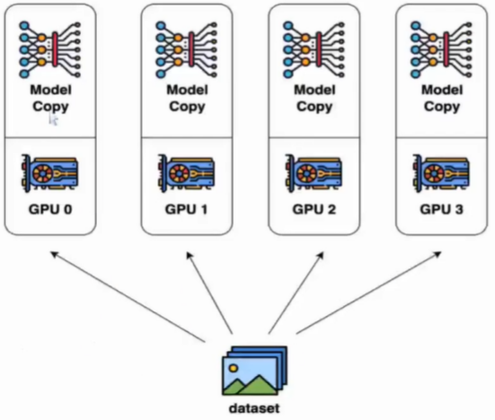
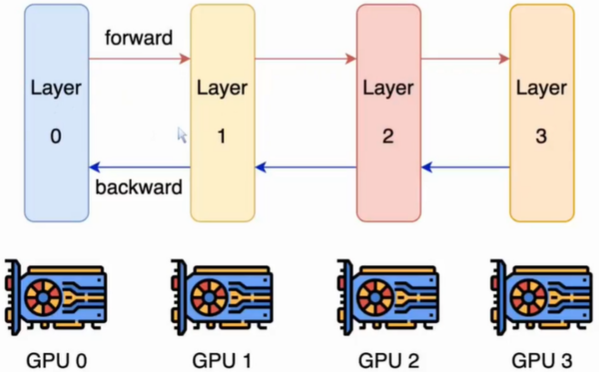
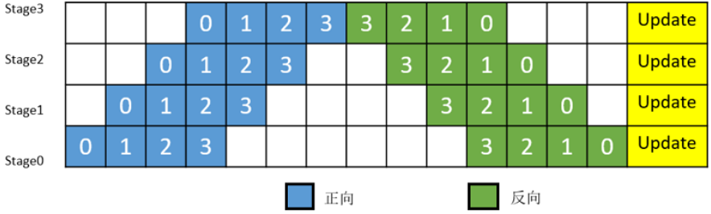
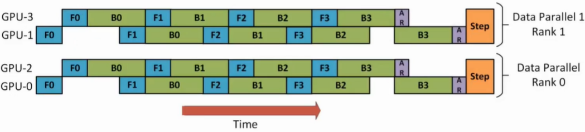
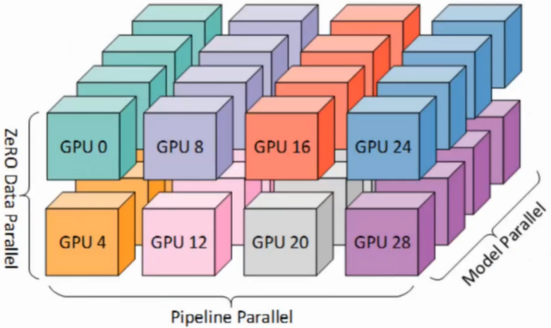
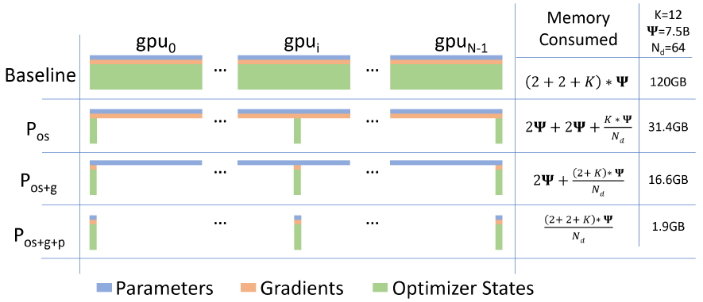
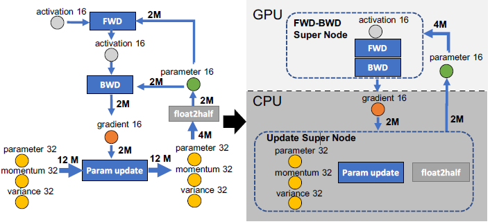
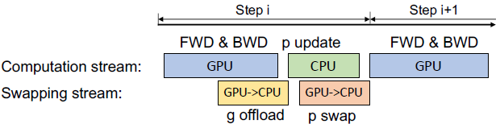
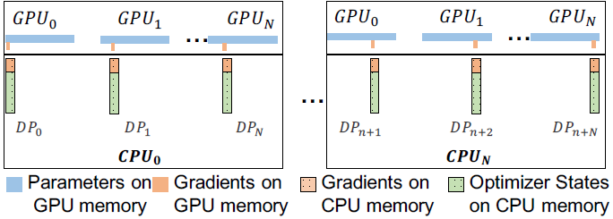
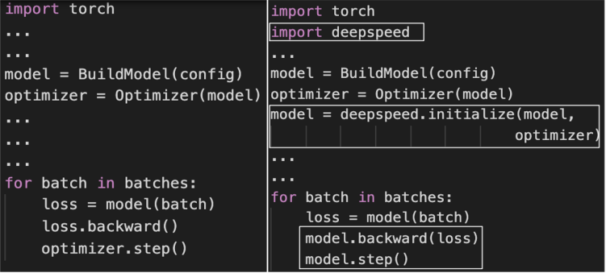

# 并行与分布式训练

torch调用CUDA只需要将数据和模型拷贝到 GPU 上即可。

```python
# 方法一
if torch.cuda.is_available():
    model.cuda()  # 不需要 model=model.cuda()
    data.cuda()

# 方法二
device = torch.device("cuda:0" if torch.cuda.is_available() else "cpu")
model.to(device)
data.to(device)

# 载入模型时，可以直接加载到 GPU 上
torch.load(file.pt, map_location=torch.device('cuda'/'cuda:0'/'cpu'))
```

## 1. DataParallel

假设有 $N$ 张卡，每张卡都保存一个模型，每一次迭代（iteration/step）都将 batch 数据分割成 $N$ 个等大小的 micro-batch，每张卡根据拿到的 micro-batch 数据独立计算梯度，然后调用 All-Reduce 计算梯度均值，每张卡再独立进行参数更新。



缺点： batch size 会随 worker 数量提高，难以在不影响收敛性的情况下无限增加 batch szie。

### 1.1  `nn.DataParallel()`

缺点：单进程，效率慢；不支持多机；不支持模型并行。其中 batch_size 为多张卡的总和。

```python
device_ids = [0, 1]  # 1. 数据并行
model = torch.nn.DataParallel(model.cuda(), device_ids=device_ids)
data = data.cuda()

optimizer = torch.optim.SGD(net.parameters(), lr=lr)  # 2.优化器并行
optimizer = nn.DataParallel(optimizer, device_ids=device_ids)
optimizer.module.step()  # 不再是 optimizer.step()

# 保存模型时，需要调用model.module.state.dict()
torch.save(model.module.state_dict(), path)

# 载入模型
net = nn.DataParallel(Resnet18())
net.load_state_dict(torch.load(path))
net = net.module
```

其类定义为`CLASS torch.nn.DataParallel(module, device_ids=None, output_device=None, dim=0)`。

`output_device`: 参数表示输出结果的 device，一般情况下省略不写，即默认在 device_ids[0]上，因此第一块卡的显存较其他卡会占用的更多一些。即，output loss 每次都会在第一块GPU相加计算，造成了第一块 GPU 的负载远远大于剩余其他的显卡。

### 1.2 `DistributionDataParallel()`

`torch.nn.parallel.DistributedDataParallel()`

```python
torch.distributed.init_process_group(backend="nccl", world_size=ngpus, 
                                     rank=args.local_rank)
# backend: 数据交换协议，一般为 nccl
# world_size: 进程数，即GPU数
# rank: 进程组中每个进程的标识符，eg: world_size=8，每张卡的rank是对应的0-7的连续整数。

torch.cuda.set_device(args.local_rank)  # 等价于命令：CUDA_VISIBLE_DEVICES环境变量

model = torch.nn.parallel.DistributedDataParallel(model.cuda(arg.local_rank), 
                                                 device_ids=[args.local_rank])
# 对每张卡的数据分配
train_sampler = DistributedSampler(train_dataset)  # 源码torch/utils/data/distributed.py
train_dataloader = Dataloader(...,sampler=train_sampler)  # sampler与shuffle互斥
data = data.cuda(args.local_rank)

# 命令行启动
python -m torch.distribted.lanuch --nproc_per_node=n_gpus train.py

# 模型保存
torch.save(model.module.state.dict(), file)

# 注意
train.py中要有接受local_rank的参数选项，launch会传入这个参数
每个进程的batch_size是单个GPU的batch_size的大小
每个周期调用train_sampler使数据充分打乱，不需要设置shuffle
```

多机多卡程序编写同上，但需要在每台机器上执行：

```python
# 第0台机器
python -m torch.distributed.launch --nproc_per_node=n_gpus --nnodes=2(机器数) node_rank=0(目前在哪个节点) --master_addr="主节点IP" --master_port=主节点端口 train.py

# 第1个机器
python -m torch.distributed.launch --nproc_per_node=n_gpus --nnodes=2(机器数) node_rank=1(目前在哪个节点) --master_addr="主节点IP" --master_port=主节点端口 train.py
```

## 2. Model Parallel

模型太大时使用，节省显存

### 2.1 Model Parallel

在多个 worker 之间划分模型的各个层



```python
class Net(nn.Module):
  def __init__(self):
    super(ToyModel, self).__init__()
    self.net1 = torch.nn.Linear(10, 10).to('cuda:0')  # 将net1放置在第1个GPU上
    self.relu = torch.nn.ReLU()
    self.net2 = torch.nn.Linear(10, 5).to('cuda:1')   # 将net2放置在第2个GPU上

  def forward(self, x):
    x = self.relu(self.net1(x.to('cuda:0')))
    return self.net2(x.to('cuda:1'))
```

### 2. Pipeline Parallel

将模型的各层划分为可以并行处理的阶段。当一个阶段完成一个 micro-batch 的正向传播时，激活内存将被发送给流水线的下一个阶段。



## 3. Hybrid Parallel

### 3.1 2D  Parallel

**数据并行+模型并行**（先进行数据并行，将数据集划分到不同的设备上，再进行pipeline 并行，将模型网络层划分为几个部分，放到不同的GPU上）



### 3.2 3D Parallel

**数据并行+模型并行+流水线并行**



## 4. Deep Speed

### 4.1 ZeRO

GPT-2 含有1.5B 个参数，如果用 fp16 格式，只需要 3GB 显存（1.5B*2B/1024^3），但是模型状态实际上需要耗费24GB(1.5*16)！所以大部分的内存被模型状态所消耗。目前，NVIDIA GPU上训练大型模型的最先进方法是通过混合精度(Mixed-Precision Training fp16/32)训练。

- Model states：模型参数(fp16)、梯度(fp16)、优化器状态（fp32，如Adam: momentum, variance）
- residual states：除了模型状态之外的显存占用，包括激活值（activation）、各种临时缓冲区（buffer）以及无法使用的显存碎片（fragmentation）。

**Model States**：假设模型参数量为 $\Psi$，则参数(fp16)和梯度(fp16)都需要 $2\Psi$ bytes 的内存，优化器状态(参数、动量和方差的fp32)分别需求 $4\Psi、4\Psi、4\Psi$ bytes 的内存。即，共需要 $2\Phi+2\Phi+(4\Phi+4\Phi+4\Phi)$ bytes 内存。



**ZeRO-DP 优化**：分片操作（partition），即每张卡只存 $\frac{1}{N}$ 的模型状态量，这样系统内只维护一份模型状态。

- $P_{os}$：parameters 和 gradients 每张卡仍保持一份，此时，每张卡的模型状态所需显存是 $4\Psi+\frac{12\Psi}{N_d}$ 字节，当 $N_d$ 比较大时，整体趋向于 $4\Psi$，也就是原来 $16\Psi$  的 $\frac{1}{4}$；
- $P_{os+g}$：parameters 每张卡保持一份，此时，每张卡的模型状态所需显存是 $2Φ+\frac{2\Psi+12\Psi}{N_d}$ 字节，当 $N_d$ 比较大时，整体趋向于 $2\Psi$ ，也即是原来 $16\Psi$ 的 $\frac{1}{8}$；
- $P_{os+g+p}$：此时，每张卡的模型状态所需显存是 $\frac{16\Psi}{N}$ 字节，当 $N_d$ 比较大时，趋向于 0。

在DeepSpeed中，$P_{os}$ 对应 ZeRO-1，$P_{os+g}$ 对应 ZeRO-2，$P_{os+g+p}$ 对应 ZeRO-3，一般使用 ZeRO-1 就足够了。

  **Residual States**：ZeRO-R 优化

1. Activation：（在前向传播结果之中存储，用来支持后向传播）

    模型并行中只是将计算的网络层（linear, cnn）放到其他GPU上，需要存储所有的激活值，GPU之间**产生激活的冗余副本**。例：1.5B 参数的GPT-2模型以 1K 的序列长度和 32 的 batch size 进行训练，需要大约 60GB 的内存。重新激活计算可以缓解，即不保存，反向传播重新计算，但需花费 33% 的重新计算开销。对于大型模型还是不够用，ZeRO-R 通过对激活进行分区来减少冗余，并使用 all gather 操作重新具化激活的副本。它还可以在适当的时候将激活 offload 到 CPU。

- 模型训练过程中经常会创建一些大小不等的临时缓冲区（如对梯度进行AllReduce）。ZeRO-R为临时缓冲区定义了适当的大小，训练过程中不再动态创建，以实现内存和计算效率的平衡。
- 在训练中，由于不同张量生命周期的变化而会导致一些内存碎片。ZeRO-R根据张量的不同生命周期来主动管理内存，防止内存碎片。

**Communication**：

对于正常的 all-reduce 更新的数据并行的模型训练，一次完整的迭代包含 reduce-scatter（散射，将根服务器上的数据散射为同等大小的数据块，每一个其他服务器得到一个数据块） 和 all-gather（聚集，将其他服务器上的数据块直接拼接到一起，根服务器获取这些数据） 两次操作，分别需要 $\Psi$ 的通信量，每 gpu 共计消耗 $2\Psi$ 通信量。

- $P_{os},~P_{os+g}$：同样需要对梯度进行 reduce-scatter 和 all-gather，通信量同样是每 gpu 共计消耗 $2\Psi$；

- $P_{os+g+p}$：需要对梯度进行一次reduce-scatter操作（每个gpu各自负责部分参数的更新，因此不需要对梯度进行all-gather操作），对参数需要进行正向和反向两次传递，所以需要消耗 $2\Psi$ 通信量，共计每 gpu 消耗 $3\Psi$ 通信量。所以是正常的 all-reduce 的1.5 倍。

- ZeRO-R 中分区激活检查点（Pa）引起的通信量增加通常不到基线 MP 的 10%。


### 4.2 ZeRO-Offload

ZeRO 是 data parallel 模式，在单机单卡下无法优化。在这种情况下，ZeRO -Offload 同时利用GPU和宿主机 CPU 的计算和存储资源，提升了较少的 GPU 资源下可以高效训练的最大模型规模。（在单张 V100 上进行最高至 1300B 参数的模型训练，10 倍于当前最高水平，同时保持每 GPU 30Tflop 的高训练吞吐量）

方法：在 ZeRO-2 的基础上将优化器状态和梯度 offload 到 CPU 内存。这个方法让 ZeRO-Offload 能最大程度降低拷贝至 CPU 导致的计算效率损失，同时达到和 ZeRO-2 相同，甚至有时超过的效率。



圆形节点表示模型状态(parameter16, gradient16, parameter32, momentum32, variance32)；边表示节点之间的数据流；边的权重是在迭代期间流过它的总数据量(bytes)。对于参数量为 $M$ 的模型，fp16 模型状态为 2M，fp32 模型状态为4M；矩形为计算节点。

对于网络某一层的某次迭代，前向传播需要用到上层的激活值，和本层的模型参数，反向传播也需要用到激活值和模型参数。Param update为 ADAM 的更新。计算类节点有四个：FWD、BWD、Param update 和 float2half，前两个计算复杂度是 $O(MB)$ ， B 是batch size，后两个计算复杂度是 $O(M)$ 。将前计算量高的节点放在 GPU，计算量小的放在CPU上，Adam状态也放在内存中，简化数据图（右侧，FWD-BWD Super Node，Update Super Node）。

即，在 GPU上面进行前向和后向计算，将梯度传给 CPU，进行参数更新，再将更新后的参数传给 GPU。为了提高效率，可以将计算和通信并行起来，GPU 在反向传播阶段，可以待梯度值填满 bucket 后，一边计算新的梯度一边将 bucket传输给 CPU，当反向传播结束，CPU基本上已经有最新的梯度值了，同样的，CPU 在参数更新时也同步将已经计算好的参数传给 GPU。



对于多 GPU：



**操作**：



### 4.3 ZeRO-Infinity

它利用GPU、CPU和NVMe内存，在不需要重构模型代码的情况下，在有限的资源上实现前所未有的模型规模。ZeRO-Infinity可以拟合具有数十甚至数百万亿参数的模型。